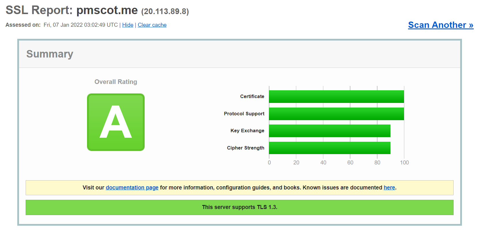
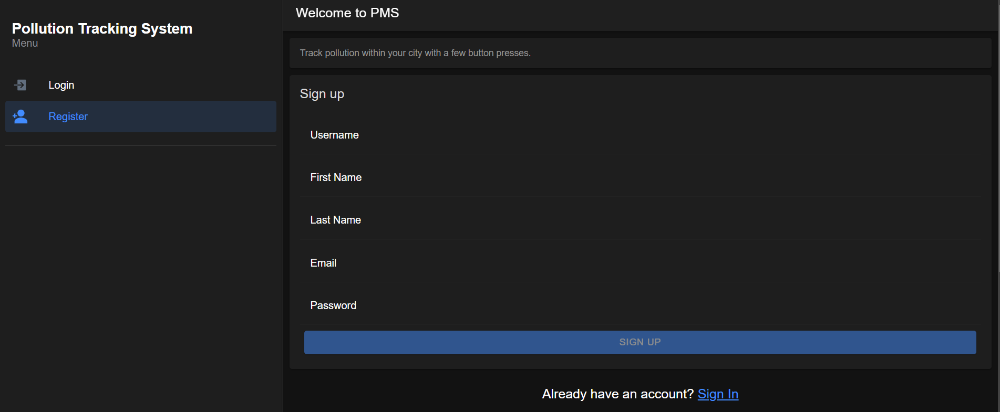
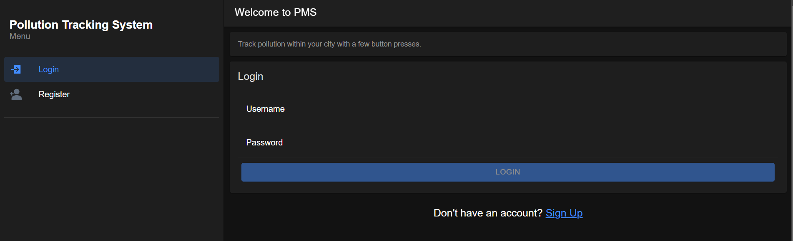
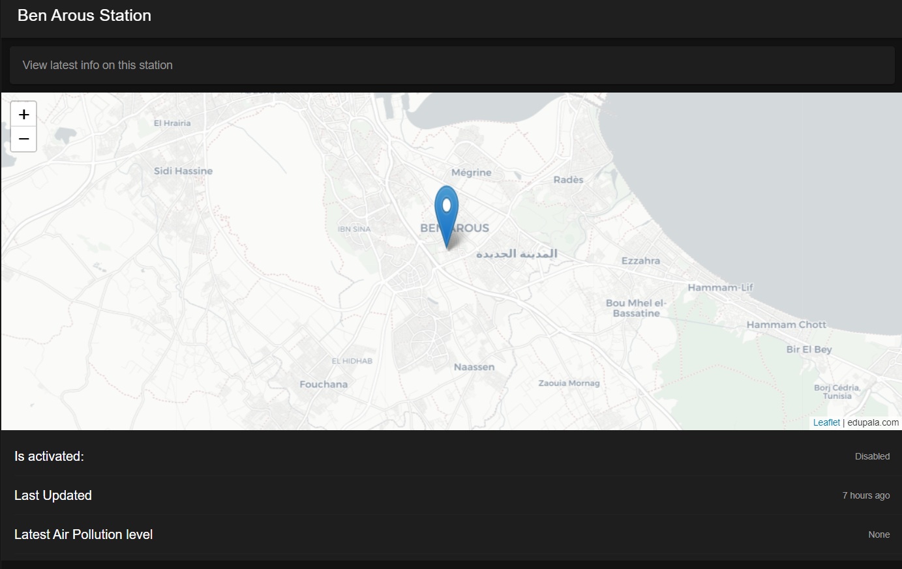
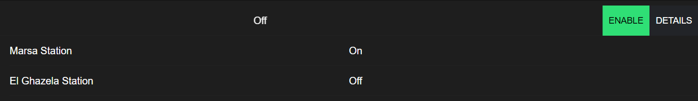
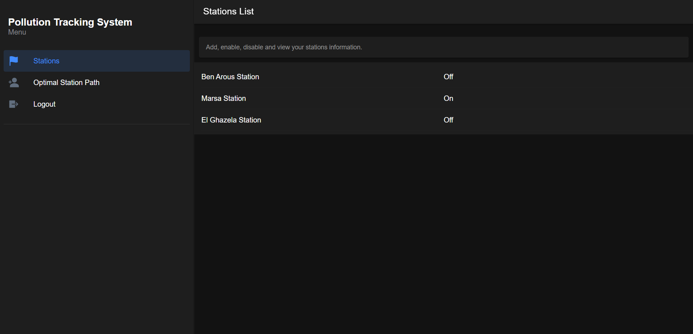
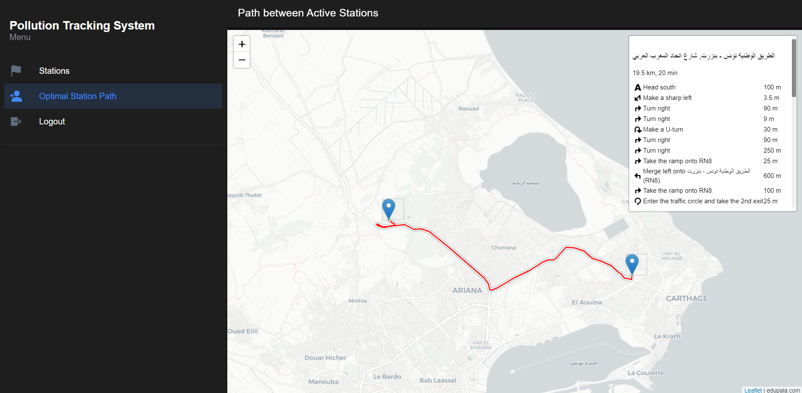

# Pollution Tracking System - Cloud of Things

This is a school project, dedicated to create a cloud-of-things based solution to monitor pollution levels in a city. 

The project was created by:
- Alaeddine Dhaoui
- Mohamed Chiboub

# Motive behind the project
Municipalities around the country have always faced too many problems in managing human waste. From delayed travels to inconsistent data to lack of tracking, garbage started to pile up and people in charge couldn't contain the problem. Therefore we aim using this solution, to help the country in optimizing the way garbage is collected. This is done by equipping each trash spot, with out IoT Node, that contains an MQ-135 sensor, capable of detecting hazardous gazes which linearly corresponds to the level of garbage in a particular spot. Municipality works can scan and activate these Nodes via their mobile application, then track in real-time the data inside thoses nodes. With the `Optimal Search Path` feature, we can generate the shortest path from the current position of the garbage collector, and passing by all of the active stations on his/her account. This makes trips to collect the trash far more quicker and efficient.

## Live Demo

You can access our website solution via [this link](https://www.pmscot.me). Or you can download our APK and install our application on Android using the file `Android_Mobile_App.apk` located in the `Docs` Folder.

## Installation Guide

If you wish to run the application on your local machine please follow these steps:
- Clone the repository
- Import the JSON file located in `IoT` into your own Raspberry Pi Card as a Node-Red Flow and customize it to your needs (You can simply change the topic to what you want).
- Run `npm install` inside the `Middleware` aswell as the `Mobile` folders in order to install the necessary dependencies.
- Go to `Middleware` and create your own `env.config.js` file inside of the `main` folder. An `env.config.sample.js` has been already prepared so that you can copy-paste it and change the values directly.
- Use your own custom certificate in order to activate HTTPS.
- Use the `npm start` command inside the `Middleware` folder to launch your backend server.
- Use the `Ionic Serve` command to run the website on your local machine or `Ionic capacitor run android` to run the same application inside an Android phone.

## Technologies
We used different frameworks and plugins as our tech stack, they are:
- Angular : v13.0.0
- Leaflet
- Ionic: v6
- Capacitor
- Node.js : v16
- Express: 4.17.1
- Node-Red
- Mosquitto Broker

## Deployment Machine
We used our free Microsoft accounts in order to sign in and get 100$ inside of Microsoft Azure. This allowed us to create a virtual machine capable of hosting the Middleware (i.e. Node.js), the MQTT Broker (i.e. Mosquitto) and handle several requests without delay. The characteristics of the virtual machine are as follow:
- Ram: 1 GB
- CPU: 1 GB
- Storage: 35 GB

Please note that the VM is hosted in East-Europe and top-notch internet connection.

## Sensors and the IoT Stack
We used one sensor, which is the [MQ-135](https://components101.com/sensors/mq135-gas-sensor-for-air-quality) sensor. It is used to detect the quality of the air around it, it has adjustable sensitivity and allows us to detect several types of gazes.

The cheap, but powerful sensor, is plugged-in to a Raspberry PI Model 3B+, which is capable to auto-connecting to the internet. Using Node-Red we created a workflow, that watches for a change in a current within the sensor, which indicates whether bad smell was detected or not. 

## Certification and Grading
We enabled HTTPS using Let's Encrypt's Certbot, allowing us to verify the ownership of our domain and to make connections to our website secure. We also generated stronger Dephi-Helman parameters for the TLS connection with a length of 4096 bits. Thanks to this, and also thanks to some Node.js parameters, we were able disable TLS 1.2 and enforce a stronger communication with our solution. We were able to grade A validation from SSLLabs.

## Solution Screenshots
Here are some of the screenshots of our solution, used within a PC-based web browser.

Signup Screen

Login Screen

Sensor Details

Enable/Disable Station Activity

Stations List

Shortest Path